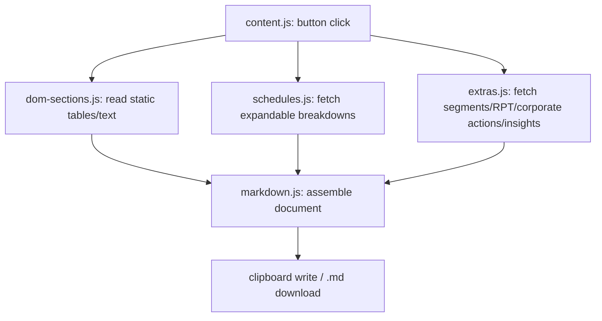

# Module map

## Data flow

## Files

- `manifest.json` — MV3 manifest. Single content script matched on
  `https://www.screener.in/company/*`, loading the built `dist/content.js`.
  No background worker, no permissions beyond the content-script match
  (all data fetches are same-origin).
- `src/markdown.js` — pure DOM-table-to-GFM-markdown conversion and document
  assembly. No Screener-specific knowledge; reusable helpers only.
- `src/dom-sections.js` — reads the server-rendered sections of a company
  page (overview ratio box, Quarters, P&L, Balance Sheet,
  Cash Flow, Ratios, Shareholding Pattern, Peer Comparison, Company Insights
  Yearly view) straight from the
  live DOM via element ids. Selectors were captured from a live page and are
  not an official contract — see the file's header comment before assuming a
  selector is stable. Insights specifically uses `extras.js`'s
  `insightsTableToMarkdown` (not the generic `tableToMarkdown`) to strip
  per-cell source-citation tooltips — see `src/extras.js`.
- `src/schedules.js` — the non-obvious part. Screener's "+"-expandable rows
  (Sales+, Expenses+, Borrowings+, Other Liabilities+, Fixed Assets+, Other
  Assets+, the three cash-flow activity rows) are not in the server-rendered
  DOM; they're fetched lazily from a same-origin JSON endpoint
  (`/api/company/<id>/schedules/?parent=<Row>&section=<section>`) only when
  clicked. This module calls that endpoint directly (`Promise.all` over a
  known parent/section list) instead of simulating clicks, using the
  `data-company-id` embedded in the page DOM. Fails soft (empty string) per
  parent on any 404/network error.
- `src/extras.js` — four more lazily-loaded widgets, each with its own
  fetch pattern (see the file's header comment for full detail):
  Product/Geographical Segments (`/api/segments/<id>/<quarters|profit-loss>/<1|2>/`,
  HTML fragment with several `data-segment-line` tbodies per fetch),
  Related Party Transactions (`/results/rpt/<id>/<consolidated|standalone>/`,
  annual party-grouped table, Screener's own response flags it as
  experimental/annual-report-extracted), Corporate Actions
  (`/company/actions/<id>/`, a 6-tab modal — Equity History, ESOPs,
  Dividend, Merger, Bonus, Split — fetched and returned in full in one
  request, but only if the request carries `X-Requested-With:
XMLHttpRequest`; without that header this one endpoint returns the full
  HTML page instead of the modal fragment), and Company Insights Quarterly
  view (`POST /insights/company/<id>/quarter/?is_consolidated=<0|1>`, the
  only POST/CSRF-guarded endpoint here — needs an `X-CSRFToken` header read
  from the `csrftoken` cookie). Fails soft per
  section/combination, same convention as `schedules.js`. "Trades" (next to
  Shareholding Pattern) is deliberately not covered here.
  This module also exports `insightsTableToMarkdown`, shared with
  `dom-sections.js`'s Yearly Insights reader, which strips per-cell
  source-citation tooltips (see "Company Insights" below).
- `src/content.js` — orchestrator. Injects the two floating buttons and
  assembles the final document order: each statement (Quarterly Results,
  Profit & Loss, Balance Sheet, Cash Flow) is immediately followed by its
  own `schedules.js`/`extras.js` breakdowns and segments, rather than
  grouping all breakdowns at the end. After the four statements: Corporate
  Actions (concrete, dated, sourced records), then Company Insights
  (Screener AI-extracted, beta — lower confidence than the above), then
  Shareholding Pattern and Ratios, then Peer Comparison, then Related Party
  Transactions last — "primary data takes precedence" over
  summary/derived/unverified data, except RPT is deliberately placed at the
  very end (after Peer Comparison) rather than next to Corporate Actions:
  for conglomerates/complex group structures it can be very large, and
  trailing off the end is preferable to crowding out everything after it.
  Wires the assembled markdown to clipboard copy or `.md` download.

## Company Insights

A "beta", Screener-AI-extracted section of custom non-standard KPIs (e.g.
"FMCG Others Segment EBITDA", "UNNATI eB2B Outlet Coverage") pulled from a
company's annual reports/presentations/concalls — cheap to read here
compared to having the harness re-derive the same numbers from source
documents via its own PDF tools. Each cell has a hover tooltip citing the
exact source document/date/page; deliberately dropped from the exported
markdown (both `insightsYearly()` and `fetchInsightsQuarterly()` route
through `extras.js`'s `insightsTableToMarkdown`, not the generic
`tableToMarkdown`) — the section-level "beta, unverified" heading already
covers that, and citing per cell would bloat the document for little
benefit.

## Explicitly out of scope

Documents, Announcements, Annual Reports, Credit Ratings, Concalls — the
Screener AI harness already has direct tool access to these (confirmed via
its own tool-list response), so scraping them here would be redundant.

## Known gaps (not yet solved, not guessed at)

- Shareholding-pattern sub-category breakdowns (FIIs+/DIIs+/Government+/
  Public+) use a `section` query param that hasn't been confirmed yet
  (`shareholding` and `shp` both 404). Left out of `schedules.js`'s parent
  list rather than guessing further.
- Peer Comparison "show all" (beyond the default ~5 rows) is read
  as-currently-displayed only; whether it needs a separate fetch call or is
  already in the DOM behind CSS has not been verified.
- "Trades" (next to Shareholding Pattern) is out of scope for now — not
  investigated.
